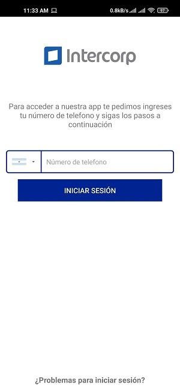

# intercorpTest

 ______  ______  

## Introducción

Proyecto de prueba, que muestra un login a travez de numero de telefono contra firebase y la posibilidad de almacenar/leer registros en Firebase Database.

## Observaciones

* Si intentas loguearte con un número de telefono distinto al que estas usando con el telefono actual puedes colocar el codigo que te envio firebase en la seccion Problemas para iniciar sesion y si el codigo es correcto podras iniciar sesion, esto es util por si estas haciendo la prueba en un telefono sin simcard o en un emulador.

* Habilite la opcion de cerrar sesion en el menu para que pueda probarse el login con diferentes numeros.

* Habilite una opcion de Ver Clientes, para poder verificar que el guardado en la Base de datos se hacia correctamente

## Autor

* **Edermar Dominguez** - [Ederdoski](https://gitlab.com/Ederdoski/about)

## Licencia

This code is open-sourced software licensed under the [MIT license.](https://opensource.org/licenses/MIT)
